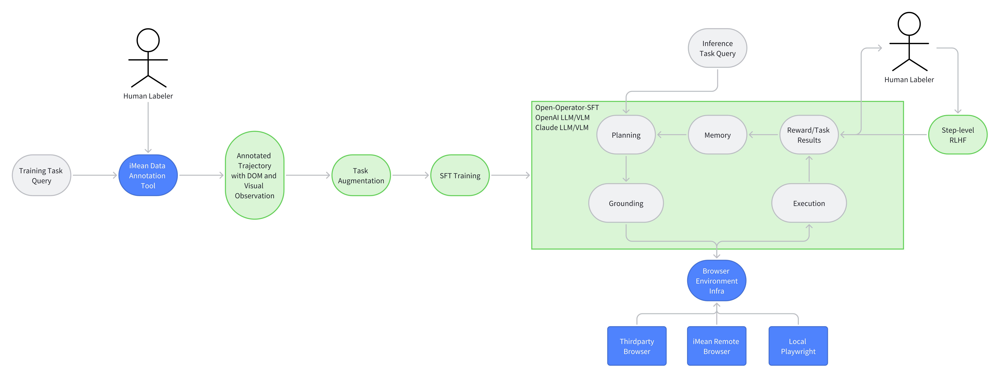
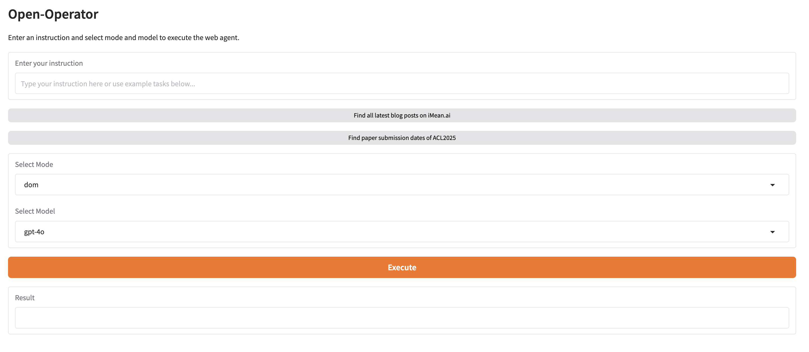

<h1 align="center">Open-Operator: Open-Source Version of OpenAI Operator</h1>


<p align="center">
  <a href="https://github.com/iMeanAI/open-operator/blob/main/LICENSE"></a>
  <a href="https://www.python.org/downloads/release/python-3110/"></a>
  <a href="https://github.com/iMeanAI/open-operator/issues"></a>
  <a href="https://github.com/iMeanAI/open-operator/pulls"></a>
  <a href="https://github.com/iMeanAI/open-operator/stargazers"></a>
  <a href="https://github.com/iMeanAI/open-operator/network/members"></a>

</p>

# open-operator

This project aims to provide the open-source community with an easy-to-use system for building, self-hosting, and evaluating web agent computer-use models. Our goal is to offer an alternative to the $200/month ChatGPT Pro and cloud-based, uncontrolled execution environments.

With open-operator, you can:
- Annotate your web trajectory data.
- Export the data for further processing.
- Prepare the data for supervised fine-tuning (SFT).
- Host and deploy the model to interact with live websites.
- Automatically evaluate the model’s performance.

We believe in empowering developers to have complete control over their web agents, from training to deployment and evaluation.

## Roadmap

Briefly describe the roadmap of the project. Green part will be included in this repo.

## Run your Base Agent Using Open-Operator
### Prepare the environment
```bash
conda create -n open-operator python=3.11
pip install -r requirements.txt
```

For the browser environment, you can use [browserbase](https://www.browserbase.com/) to setup the following environment variables.

```bash
export BROWSERBASE_API_KEY=your_api_key
```


### Initialize the base agent
```bash
python inference/app.py
```
You can select the base model you want to use in the dropdown menu.(From Anthropic, Google, OpenAI, etc.)



Then start your first experience with Open-Operator!

## Data Annotation and Downloading
Follow the step wise instruction below:
1. Download the latest iMean builder extension here: [iMean Builder](https://drive.google.com/file/d/1BpLOQ9M41rdc6VYY-1Aes1lhzo5-LdiH/view?usp=sharing)
2. Install the extension on your browser.
3. Record your web trajectory data you want to train your model on in the **natural** way you interact with the website. Edit the title of each data.
4. Create a private channel on iMean Builder Platform and move all the data into that channel. -> How to: [Docs](https://webcanvas.gitbook.io/webcanvas-docs/3.-evaluation)
5. Create a private challenge on [WebCanvas website](https://www.imean.ai/web-canvas) and connect it with the channel in the last step. -> How to: [Docs](https://webcanvas.gitbook.io/webcanvas-docs/3.-evaluation)
6. Get the challenge id and use it to download all the data from the iMean Builder Platform.

Set the challenge id, iMean Builder username, password in `configs/config.yaml`.

Just run `python main.py` to download the data. Now you can download some sample data by default challenge id.

If you log in iMean Builder with Google account, you can set the password on the profile page.


## Data Pre-processing

For Dom Tree mode, Just run `python main.py`

For Vision mode, code coming soon.


## Native Agent Model Training
coming soon

## Native Agent Model Evaluation
coming soon

## TODO
- [x] Instruction on how to annotate your web trajectory data
- [x] Data downloading
- [x] Pre-process the data to be SFT-ready - DOM Tree
- [ ] Pre-process the data to be SFT-ready - Vision
- [ ] Host the local model and inference on live websites
- [ ] Automatically evaluation using WebCanvas framework

## Previous Solutions
For reference on web agent evaluation, you can check out the WebCanvas repo: [WebCanvas](https://github.com/iMeanAI/WebCanvas)

For more information on open-source GUI agent research projects and collaborations, check out WebAgentLab ([WebAgentLab Homepage](https://webagentlab.notion.site/homepage)).

**Stay tuned!**
